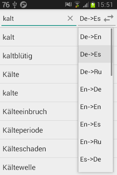
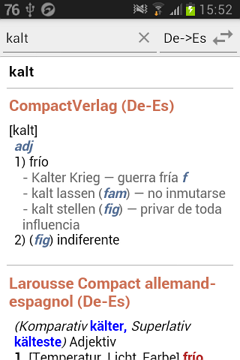
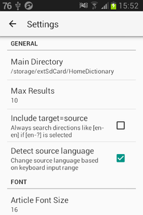
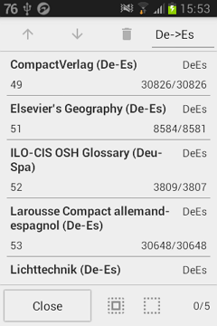
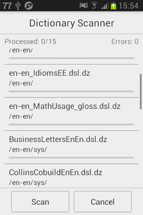
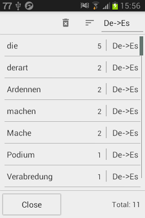

# Home Dictionary

Mobile dictionary shell application which allows to add multilanguage dictionary files in Lingvo DSL format and search across added dictionaries in 1 or multiple language directions.

## Features

- read and index dictionaries in DSL format (or compressed DSL.DZ variation)
- select a language pair from the dropdown list
- search for a word translation within the selected languages
- resulting article contains word translation from all the dictionaries in the selected language pair
- output formatted dictionary article
- zoom article content with wrapping to allow comfortable viewing
- navigate through articles using internal links
- manage added dictionaries (change order in article, remove and view main information)
- save and view search history ordering it by a set of conditions
- change settings such as main storage directory, max results to show, article font size

## Usage

- Select a language pair on the right. "En->(\*)" means from English to all available languages.
- Type a word and select a result below.
- Zoom the article, search the article text (from the menu), scroll by swiping the page or with a fast scroller on the right.
- "Edit Dictionaries" menu opens a page allowing to reorder dictionaries
- "History" menu shows all searched words and hits count and allows to order the results by word, direction, hits and date.
- "Abbreviations" menu shows a page with abbreviation dictionaries corresponding to the current language direction.
- in Settings it's possible to select Max Results to limit number of words to search, change article font size and increment size (for Android Kitkat+ devices).

## Versions

**Demo version** can be found in the [**releases**](/releases/latest) section.

